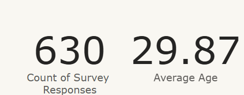
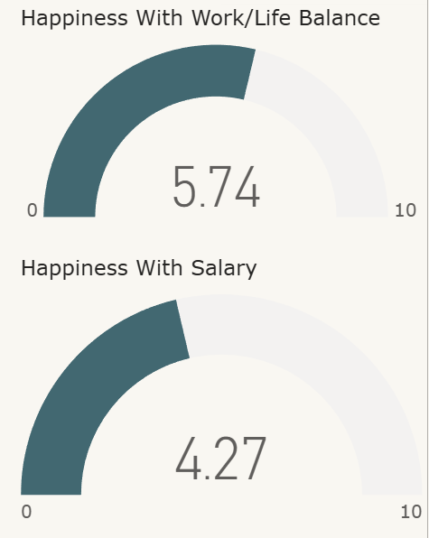
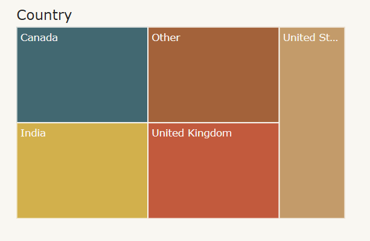

# Corporate Data Science Survey Project

A little over 600 workers in the Data field have completed surveys in regards to work/life balance. The data includes questions related to salary, preferred programming language, and how happy they are with their work. It spans across the field and multiple countires.

# Goal

Our goal is to learn and experiment with using multiple different types of visualizations to build a dashboard that shows this information.

# Data 

The data comes from [Kaggle}(https://www.kaggle.com/datasets/ahmedmohamedibrahim1/data-professional-survey-breakdown) It was already mostly ready for use. We just had to remove a few unneeded columns.

# Choosing the visuals 

## Cards

Fields used:
- Count of Survey Respones
- Average Age

We used cards for these values because they important numbers that we want to stand out alone.

## Gauges

  

Fields used:
- Happiness with Work/Life Balance
- Happiness with Salary

Gauges were chosen to showcase the the information as a type of meter. The min and max are quite low and the amount could be perceived as a glass fililng.

## Donut Chart

Field used:
- Easiness of entering field

The Donut Chart was chose because it is commonly used. It is also good at comparing how large of a percentage each option takes up.

## Stacked Bar Chart

Fields used:
- Job Title
- Average Salary

The stacked bar chart is good for comparing simple values.

## Stacked Column Chart

Fields used:
- Count per Language
- Programming Language

Allows us to compare multiple groups per value.

## Tree Map

Fields used:
- Country

The tree map easily lets us list several regions next to each and size them according to their values.

# Dashboard

[Interactive Dashboard](https://app.powerbi.com/view?r=eyJrIjoiYTZkMjkxZTUtYTIyMS00MWFjLWFhNzEtZTNlZWI5M2Q4MWFjIiwidCI6IjRiZjk1MzI5LTBiMzAtNGY5Yi1iMmUxLWFmNjgyYWVhZDViYyIsImMiOjJ9)
